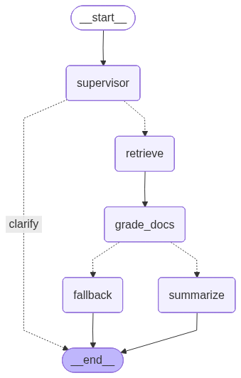

# Wikipedia CRAG Chatbot

Very basic RAG chatbot over a Wikipedia-style text corpus.

## Project Summary

```text
TFB4FY_homework/
├── README.md
├── requirements.txt
├── prepare_data.py
├── main.py
├── export_graph.py
├── conf/
│   ├── config.yml
│   ├── supervisor_agent_config.yml
│   ├── summary_agent_config.yml
│   ├── corrective_agent_config.yml
│   └── fallback_agent_config.yml
├── data/
│   ├── raw/AllCombined.txt
│   ├── chunks/AllCombined_chunk1500_overlap220.json
│   └── embeddings/AllCombined_chunk1500_overlap220.npz
├── model_graph/
│   └── model_graph.png
└── src/
	├── settings.py
	├── models.py
	├── conversation_memory.py
	├── agents/
	│   ├── langgraph_rag.py
	│   ├── supervisor_agent.py
	│   ├── retriever_agent.py
	│   ├── summary_agent.py
	│   └── corrective_agent.py
	└── data_preprocessing/
		├── loader.py
		└── preparation.py
```


### File Roles

| File | Purpose |
| --- | --- |
| [README.md](README.md) | Describes the project, how to run it, and the main files and data assets included in the repository. |
| [requirements.txt](requirements.txt) | Lists the Python dependencies needed to run the chatbot and its preprocessing scripts. |
| [prepare_data.py](prepare_data.py) | Runs the preprocessing pipeline that chunks the corpus and builds the cached embeddings. |
| [main.py](main.py) | Starts the Streamlit chat application and handles the user interface loop. |
| [export_graph.py](export_graph.py) | Exports the LangGraph workflow diagram for documentation. |
| [conf/config.yml](conf/config.yml) | Stores the global project settings such as corpus path, chunking, and retrieval parameters. |
| [conf/supervisor_agent_config.yml](conf/supervisor_agent_config.yml) | Configures the routing supervisor that decides whether to retrieve, clarify, or reject a question. |
| [conf/summary_agent_config.yml](conf/summary_agent_config.yml) | Configures the answer synthesis agent that writes grounded responses from retrieved evidence. |
| [conf/corrective_agent_config.yml](conf/corrective_agent_config.yml) | Configures the relevance grader that checks whether retrieved chunks are useful enough to keep. |
| [conf/fallback_agent_config.yml](conf/fallback_agent_config.yml) | Configures the fallback answer generator used when retrieved chunks are not relevant enough. |
| [data/raw/AllCombined.txt](data/raw/AllCombined.txt) | Contains the raw Wikipedia-style text corpus used to create chunks and embeddings. |
| [data/chunks/AllCombined_chunk1500_overlap220.json](data/chunks/AllCombined_chunk1500_overlap220.json) | Stores the chunked version of the raw corpus along with chunk metadata. |
| [data/embeddings/AllCombined_chunk1500_overlap220.npz](data/embeddings/AllCombined_chunk1500_overlap220.npz) | Stores the cached embedding vectors used by the FAISS retriever. |
| [model_graph/model_graph.png](model_graph/model_graph.png) | Shows the visual layout of the LangGraph agent pipeline. |
| [src/settings.py](src/settings.py) | Loads YAML configuration files into typed project settings objects. |
| [src/models.py](src/models.py) | Defines the typed settings and data models shared across the application. |
| [src/conversation_memory.py](src/conversation_memory.py) | Filters chat history to keep only the turns that are relevant to the current question. |
| [src/agents/langgraph_rag.py](src/agents/langgraph_rag.py) | Builds the LangGraph workflow and wires the supervisor, retriever, grader, summarizer, and fallback nodes together. |
| [src/agents/supervisor_agent.py](src/agents/supervisor_agent.py) | Classifies the user request and decides whether the graph should retrieve, clarify, or reject. |
| [src/agents/retriever_agent.py](src/agents/retriever_agent.py) | Loads cached chunks and embeddings, builds the FAISS index, and retrieves the most similar chunks for a query. |
| [src/agents/summary_agent.py](src/agents/summary_agent.py) | Produces the final grounded answer using only the retrieved context and relevant conversation history. |
| [src/agents/corrective_agent.py](src/agents/corrective_agent.py) | Grades retrieved chunks for relevance and produces the fallback answer when the chunks are not useful. |
| [src/data_preprocessing/loader.py](src/data_preprocessing/loader.py) | Reads the raw corpus, builds chunk and embedding cache paths, and saves or loads cached preprocessing artifacts. |
| [src/data_preprocessing/preparation.py](src/data_preprocessing/preparation.py) | Orchestrates the chunking and embedding generation pipeline used by `prepare_data.py`. |

## Run

Use these 2 commands:

```bash
python prepare_data.py
streamlit run main.py
```

## Model Graph



## Data

- Raw corpus file used by the app: `data/raw/AllCombined.txt`
- Kaggle page to find the dataset: [Kaggle dataset search (Simple English Wikipedia)](https://www.kaggle.com/datasets/ffatty/plain-text-wikipedia-simpleenglish)
- After downloading the data .zip file the AllCombined.txt needs to be copied to `data/raw/`